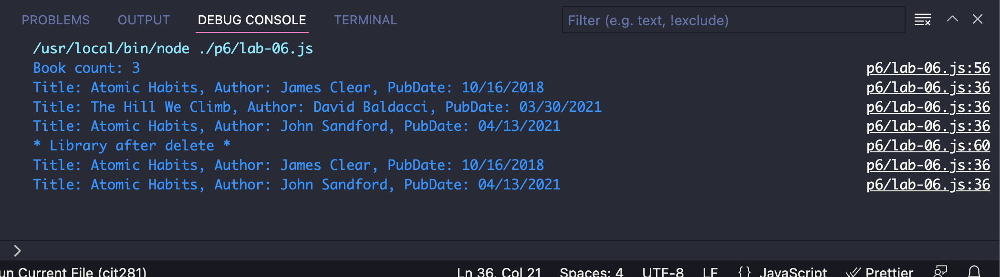

# cit281-lab-6.io
lab 6

This lab asked us to join GitHub and work through Introduction to GitHub course.

We created lab files 

We also created and test Book, and Library class

Here is what the output of lab6 looks like:

